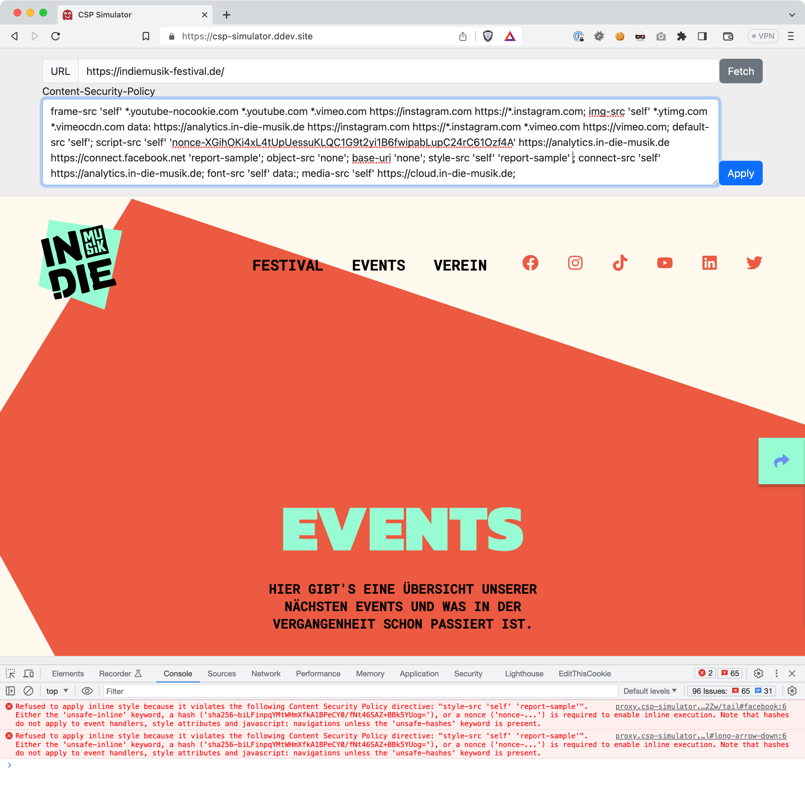

# CSP Simulator

DDEV application based on Laravel for simulating the
[Content-Security-Policy](https://developer.mozilla.org/en-US/docs/Web/HTTP/CSP)
impact on arbitrary URLs, by using a man-in-the-middle HTTP proxy.



## Requirements

* having Docker installed locally (see https://docs.docker.com/get-docker/)
* having DDEV installed locally (see https://ddev.readthedocs.io/en/stable/#installation)

## Install

```
git clone https://github.com/ohader/csp-simulator.git
cd csp-simulator

ddev start
ddev composer install
```

## Web GUI

* open https://csp-simulator.ddev.site/ in your favorite browser
* put in the desired URL that shall be analyzed (needs to be resolvable for Docker/DDEV)
* click on `fetch` to resolve the current `Content-Security-Policy` headers (if any)
* adjust the CSP details in the textarea & see inspect results by clicking on `apply`

---

© 2023 Oliver Hader <[oliver.hader@typ3.org](mailto:oliver.hader@typ3.org)> \
[GitHub](https://github.com/ohader) | [LinkedIn](https://www.linkedin.com/in/oliverhader)
